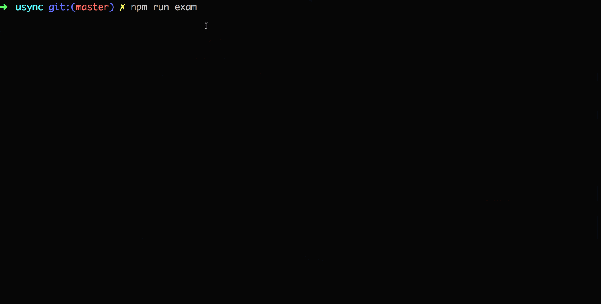

<p align="center">
    <pre style="background-color: #fff;">
          _   _  ___  _   _  _ __    ___
         | | | |/ __|| | | || '_ \  / __|
         | |_| |\__ \| |_| || | | || (__
          \__,_||___/ \__, ||_| |_| \___|
                      |___/
                  Version 0.0.9
    </pre>
</div>


<br/>

# Usync

The core of `Usync` is uniform serial execution, which can be run in browser or Node.js enviroment.

In addition, it supports task segmentation and task tree design. The root task state is added by default. Because `Usync` is very lightweight, core API is scarce, so `Usync` provides a set of hook and extension methods for life cycles that allow you to easily extend `Usync`.

```js
app.use([task1,task2,task3 ... ]).start()
```


<br/>

# Quick Start
## install

```js
npm i usync -S
// or
yarn add usync
```
If you want to test Usync in the browser, you can use the CDN as follows:

- [UNPKG](https://unpkg.com/usync/dist/) 
- [jsDelivr](https://cdn.jsdelivr.net/npm/usync/dist/)

## first usync app

```js
// Create a task whose name is 'Work'
var app = Usync.app('Work')

// Define three subtasks
function task1(root, next) {
    // root: The root state that continues to pass down during the life cycle of 'Work' task
    // next: Call the next task
    setTimeout(() => next(), 200)
}

function task2(root, next) {
    setTimeout(() => next(), 300)
}

function task3(root, next) {
    setTimeout(() => next(), 200)
}

// Define task queues
app.use([task1,task2,task3])

// Running task
app.start()
```

<br/>

# features

1. the type of subtask supports: Function / Usync / Promise / Async Function
2. Provide Lifecycle Hook and Plugin mechanisms to facilitate extension
3. Provide a root state (Root State) which is valid in the task life cycle by default

<br/>

# API

<br/>

# `Usync.app([state])`
- `state` Array | Object | String
- `return value` A Usync app instance

It's important to note that the state parameter is optional, and when the entire life cycle of the app needs to depend on a certain initialization state, we can inject it through state, for example:

```js
let root = {
    // Initialize root status
} 
let app = Usync.app(root)
```

Next, we can use the root state at each task in the app lifecycle:

```js
app.use(function task1(root) {
    fx(root) // Perform some operations on the root state
});
```

In addition, Usync initializes some values for the `root state`:

attribute | description
---|---
app.$current | Current task
root.$prev | previous task
root.$next | next task


> Note: when the state is not set, the Usync constructor will generate a empty root state object by default

<br/>

# `Usync.prototype.use(task)`
- `task` Function | Usync | Promise | Async Function | Array
- `return value` this

This method is used to add subtasks to the Usync App. The `use()` method supports chain calls and also supports the introduction of an array.

```js
app.use(task1).use(task2).use(task3)
// Equivalent to
app.use([task1, task2, task3])
```

The execution order of the above example is: `task1 => task2 => task3`。

The example of `use()` usage can be seen in the following example:

Type | Example
---|---
Function | [Demo](examples/1_function.js)
Promise | [Demo](examples/2_promise.js)
Async/Await | [Demo](examples/3_async.js)
Usync | [Demo](examples/4_task_tree.js)

> Note: The task needs to be a named function. Unlike the design philosophy `(taskName, taskHandler)` of [orchestrator](https://github.com/robrich/orchestrator) and its [gulp](https://github.com/gulpjs/gulp)  , Usync requires only one `taskHandler`, and Usync will use the name of `taskHandler` as the task's name.

You can run the [examples](examples) provided by this project with `git clone`：

```
git clone https://github.com/toxichl/usync.git
npm i && npm run example
```



> Note：The above log effect is not built-in at Usync ，Because Usync core doesn't have any  unique API of `Node` or `Browser`. This log effect is implemented through a plug-in [logger](plugins/logger.js) of Usync.


<br/>

## life cycle

The hook function of the life cycle provided by Usync is as follows:

Hook | Parameter | Description
---|---|---
`init` | `(UsyncApp)` | Before the end of an `Usync app` creation
`beforeUse` | `(UsyncApp, task)` | Before a task is going to be used in a `Usync app`
`appStart` | `(root)` | Before a `Usync app` starts running
`appEnd` | `(root)` | Before a `Usync app` is finished running
`taskStart` | `(root)` | Before a `task` starts running
`taskEnd` | `(root)` | Before a `task` is finished running

The properties available on a task are as follows:

Attribute | Description
---|---
task.name| task's name
task.$parent | task's parent

About how to use these hooks, need the help of  [Usync.extend()](# `Usync.extend(object)`) or [Usync.prototype.extend()](# `Usync.prototype.extend(object)`), please continue to look down.。


<br/>

# `Usync.extend(object)`
- `object` An object consisting of one or more life cycle hook processing functions
- `return value` null

`extend ()` accept an object as parameters, the object can contain multiple attributes, the attribute name for life cycle's name, the attribute value is a handler function, About the incoming parameter of handler function, please see last section. A simple `extend()` example is as follows:

```js
Usync.extend({
    taskStart(root) {
        console.log(`Starting ${root.$current.name}`)
    },
    taskEnd(root) {
        console.log(`Finished ${root.$current.name}`)
    }
})
```

In fact, this is the core part of implementing the plug-in [logger] (plugins/logger.js). Is it very simple?


<br/>

# `Usync.prototype.extend(object)`
- `object` An object consisting of one or more life cycle hook processing functions
- `return value` null

Same to the `Usync.extend()`, the difference of them is that the `Usync.extend()` will influence all the `UsyncApp`, But `Usync.prototype.extend()` is only valid for the current `UsyncApp`. Please choose flexibly according to different scenes.


<br/>

# `Usync.plugin(plugin)`
- `plugin` Object | Function
- `return value` null

> The plug-in's API design is inspired by [Vue](https://cn.vuejs.org/v2/guide/plugins.html)

`Usync` uses a plug-in API design that is consistent with `Vue`, and the `Usync` plug-in should have an open method, `install`. The first parameter of this method is the constructor of the `Usync`, and the second parameter is the optional option object.

You can refer to the implementation of [logger](plugins/logger.js)  to learn how to combine a lifecycle hook and plugin API to write a plug-in for `Usync`.

<br/>

